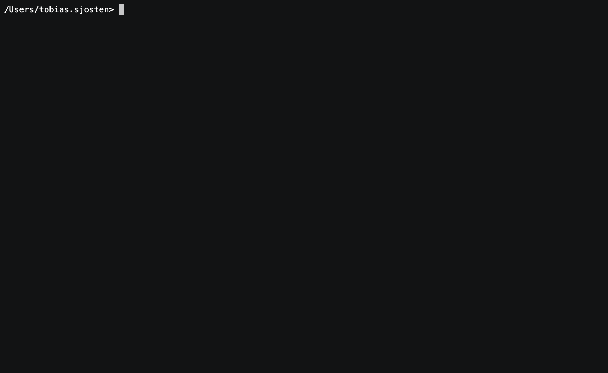

# nogfx [](https://app.codacy.com/gh/tobiassjosten/nogfx) [](https://app.codacy.com/gh/tobiassjosten/nogfx) [](https://opensource.org/licenses/MIT)

Because the book is always better.

## Demonstration



## Installation

With [Homebrew](https://brew.sh/):

```bash
brew tap tobiassjosten/nogfx
brew install nogfx
```
